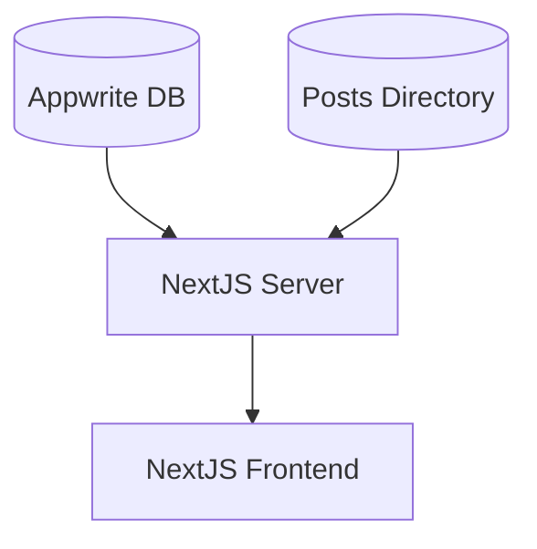

# Markdown Blog

## Motivation


## Installation and usage

### Prerequisites

If you are planning to add posts via the [Appwrite Database](https://github.com/appwrite/appwrite) capability, you need to have a [Appwrite instance](https://github.com/appwrite/appwrite) running on your local machine or on a server.

### Configuration

1. [`configuration.json`](config/configuration.json) in `config`
   - Example AppwriteDB

```json
    "appwriteDatabase": {
        "url": {
            "host": "localhost",
            "port": 3000
        },
        "projectId": "YOUR_PROJECT_ID",
        "postBucketId": "YOUR_POST_BUCKET_ID",
        "apiKey": "YOUR_API_KEY"
    }
```

2. Environment variables `.env` or Docker `-e`
   - Example AppwriteDB

```bash
ENV_APPWRITEDATABASE_URL_HOST=localhost
ENV_APPWRITEDATABASE_URL_PORT=3000
ENV_APPWRITEDATABASE_PROJECTID=YOUR_PROJECT_ID
ENV_APPWRITEDATABASE_POSTBUCKETID=YOUR_POST_BUCKET_ID
ENV_APPWRITEDATABASE_APIKEY=YOUR_API_KEY
```

All [Configuration keys](src/types/Configuration.ts):
|key|subkeys|type|purpose|
|:---|:---|:---|:---|
|**blogName**||`string`|Name of the blog to be displayed on the page|
|**blogDescription**||`string`|A small description about the blog to be displayed in the header and seo|
|**blogCopyright**||`string`|Maintainer of the blog|
|**colors**|dark|`{ "primary": string, "secondary": string, "font": string, "accent": string }`|Color definition for dark theme|
||light|`{ "primary": string, "secondary": string, "font": string, "accent": string }`|Color definition for light theme|
|**appwriteDatabase**|url|`{ "host": string, "port": string\|number }`|Connection url of the appwrite database|
||projectId|`string`|Id for identifying the correct project|
||postBucketId|`string`|Id of bucket where blog files should be stored|
||apiKey|`string`|Api key for accessing the appwrite database. **!Make sure only reading files is permitted!** |

When changing the configuration, you need to restart the server.

### Docker

- **Volumes**:
  - [`config`](config/): for accessing the configuration file
  - [`posts`](posts/): when wanting to add posts via file explorer
  - [`public/images`](public/images/): when wanting to add images
- **Ports**:
  - `3000`: for displaying NextJS frontend

1. `docker pull ghcr.io/tim0-12432/markdown-blog:latest`
2. `docker run --name markdown-blog -d -p 8082:3000 -v markdown-blog_config:/config -v markdown-blog_posts:/posts -v markdown-blog_images:/public/images -e <ENVIRONMENT_VARIABLES> ghcr.io/tim0-12432/markdown-blog:latest`

### NodeJS

1. Clone the [repository](https://github.com/tim0-12432/markdown-blog)
2. Install the dependencies via [`npm install`](package.json)
3. Build the application via `npm run build`
4. Run the server via `npm run start`

## Structure



## License

[MIT](/LICENSE.md)
