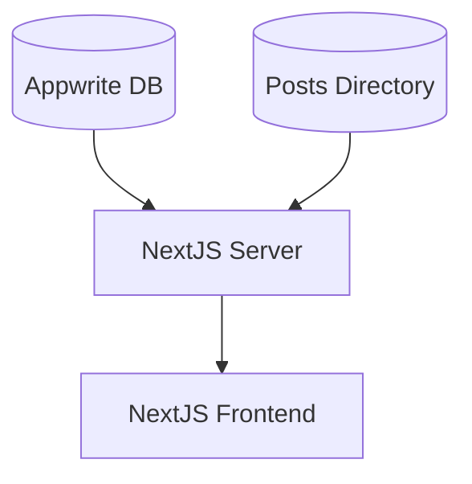

# Markdown Blog

## Motivation

## Installation and usage

### Docker

### NodeJS

## Structure

```mermaid
graph TD
    A[(Appwrite DB)] --> N[NextJS Server]
    P[(Posts Directory)] --> N
    N --> F[NextJS Frontend]
```

## License

[MIT](/LICENSE.md)
